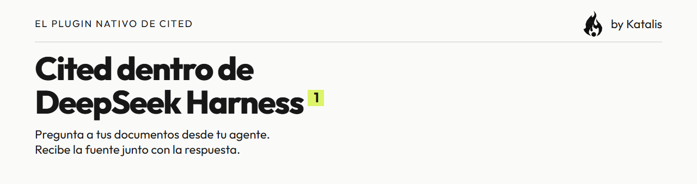
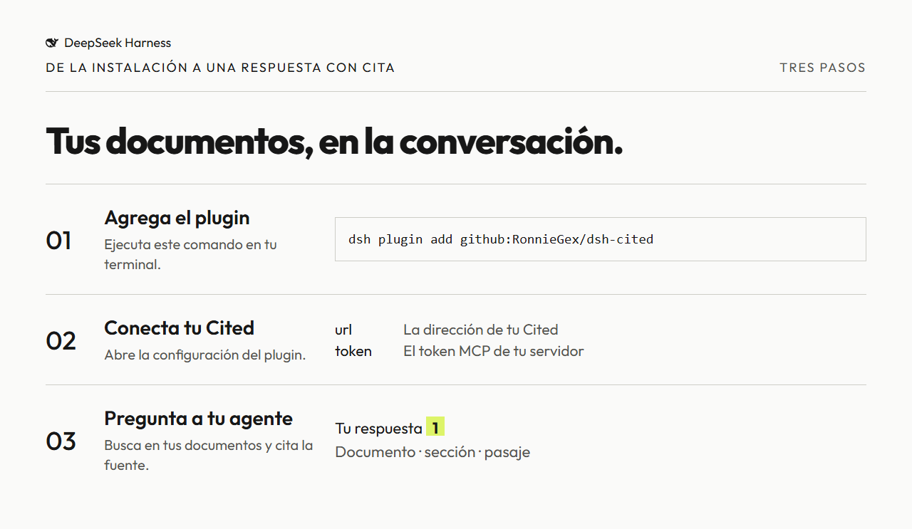

<h1 align="center"><picture><source media="(prefers-color-scheme: dark)" srcset="docs/images/readme-banner-es-dark.png"></picture></h1>

<p align="center">Consulta tus documentos de Cited desde DeepSeek Harness y recibe la fuente junto con cada respuesta.</p>

[](LICENSE)
[](#compatibilidad)
[](https://github.com/RonnieGex/dsh-cited/actions/workflows/ci.yml)


- Conserva tus documentos en Cited mientras trabajas con tu agente.
- Comprueba las respuestas con pasajes y fuentes numeradas.
- Elige entre buscar documentos y recibir una respuesta completa con citas.

[English](README.md) · [Español](README.es.md) · [中文](README.zh.md)

**Cited dentro de DeepSeek Harness.** Dos herramientas nativas permiten a tu agente buscar en una instalación de [Cited](https://github.com/RonnieGex/cited) y responder desde sus documentos con citas numeradas. El plugin se conecta a la instalación que configures mediante `POST /api/mcp`.

**Desarrollo inicial.** La instalación y una respuesta real con cita se probaron sin interfaz. Consulta los alcances en la [tabla de compatibilidad](#compatibilidad) con fechas.

[Cómo funciona](#cómo-funciona) · [Respuesta real](#una-respuesta-real) · [Instalar](#instalar) · [Configurar](#configurar) · [Herramientas](#las-dos-herramientas) · [Token](#tu-token) · [Compatibilidad](#compatibilidad) · [Desarrollo](#desarrollo) · [Licencia](#licencia)

## Cómo funciona

<picture><source media="(prefers-color-scheme: dark)" srcset="docs/images/how-it-works-es-dark.png"></picture>

1. Ejecuta `dsh plugin add github:RonnieGex/dsh-cited`.
2. Abre la configuración del plugin y llena **url** y **token**.
3. Pregunta a tu agente. `cited_search` devuelve pasajes numerados; el agente los usa para responder con `[1]`.

Cited aloja los documentos y la búsqueda. DeepSeek Harness aloja al agente y este plugin. Estas herramientas nativas no necesitan una fila de cliente MCP en `cordis.yml`.

## Requisitos

- DeepSeek Harness dentro del [rango declarado](#compatibilidad).
- Un servidor Cited en ejecución con MCP habilitado y su token.
- Node `>=22.19`; el desarrollo y la evidencia usan Node 24.

## Una respuesta real

<picture><source media="(prefers-color-scheme: dark)" srcset="docs/images/real-answer-dark.png"></picture>

El **2026-10-09**, un nuevo `DSH_HOME` temporal instaló el plugin desde GitHub. DeepSeek buscó en los documentos públicos de muestra de Cited y respondió:

> Según los documentos, **afinar una bicicleta en Café La Horquilla cuesta 380 pesos** [1].
>
> Fuente: `cafe-la-horquilla.md`, sección *Precios* [1].

La imagen presenta la pregunta guardada, la llamada real, el pasaje y la respuesta. No es una captura de escritorio. La pregunta natural no nombra herramientas. DeepSeek eligió `cited_ask` y respondió en español. El pasaje resaltado viene de otra corrida natural de `cited_search`, enlazada en el registro. [Texto completo](docs/evidence/headless-answer.txt) · [Registro de ejecución](docs/evidence/headless-answer.json). La búsqueda usó palabras clave sin proveedor de embeddings; el agente usó un modelo real de DeepSeek. La búsqueda separada dejó las 19 tablas sin cambios; `cited_ask` actualizó el estado de llamadas al modelo.

## Instalar

Ejecuta el comando de instalación verificado:

```sh
dsh plugin add github:RonnieGex/dsh-cited
```

En la app, **Plugins → Add plugin** abre el mismo administrador de plugins. Pega `https://github.com/RonnieGex/dsh-cited`.

El repositorio incluye `lib/`: instalar no requiere compilar ni dar permiso `allowBuilds`.

## Configurar

Abre la configuración del plugin:

| Campo | Valor |
|---|---|
| `url` | Dirección de Cited, por ejemplo `https://cited.example.com`. El plugin agrega `/api/mcp` o lo conserva cuando ya está presente. Se eliminan los parámetros de consulta y los fragmentos de la URL. |
| `token` | El `CITED_MCP_TOKEN` del servidor. Marcado como campo secreto. |
| `timeoutMs` | Tiempo límite positivo por llamada en milisegundos; **30000** por omisión. |

Sin token en el servidor, el endpoint MCP de Cited está apagado. Genera uno con `openssl rand -base64 32`, defínelo como `CITED_MCP_TOKEN` en el servidor Cited (consulta la [guía MCP](https://github.com/RonnieGex/cited/blob/main/docs/mcp.md)) y escribe el mismo valor en el plugin. No lo pongas en prompts, capturas ni Git.

`url` y `token` comienzan vacíos para permitir instalar antes de configurar. Una llamada reporta el campo faltante como error de herramienta sin romper el harness. Después de llenar ambos, pide al agente que busque una frase presente en tus documentos.

## Las dos herramientas

| Herramienta | Entrada | Resultado |
|---|---|---|
| `cited_search` | `query: string`, `limit?: integer` de **1 a 8**, **5** por omisión | `{ passages: [{ n, document, heading, position, excerpt }] }` |
| `cited_ask` | `question: string`, `sessionId?: string` | `{ status, answer, citations }`; estado `answered` o `refused` |

**Busca y deja que tu agente responda.** `cited_search` recupera pasajes sin llamar al modelo de respuestas de Cited. Cada uno incluye fuente y número de cita. Sin coincidencias no hay pasajes, tampoco una respuesta inventada. El modelo del agente y cualquier proveedor de embeddings configurado todavía pueden generar cargos.

**Deja que Cited redacte.** `cited_ask` ejecuta el proceso de respuestas de Cited y devuelve una respuesta citada o una negativa explícita. Las citas contienen los campos del pasaje más `lead`, la longitud del texto superpuesto. El resultado de texto incluye documento, sección, posición y extracto exacto de cada fuente. Reutiliza `sessionId` para guardar una conversación y su hilo en Cited. Esto puede consumir el presupuesto del modelo del servidor.

## Tu token

- Se envía como `Authorization: Bearer` al endpoint configurado; no se agrega a los argumentos de herramientas ni a su salida normal.
- El esquema lo marca como secreto para el manejo de campos del harness. Esto no demuestra cifrado en reposo. Protege la configuración y usa HTTPS en servidores remotos.
- Se oculta en los errores de transporte, junto con las credenciales en URL. Autorización rechazada, endpoint apagado, tiempo agotado y host inaccesible se convierten en errores breves de herramienta.
- El plugin no tiene base propia de documentos. Cited guarda los documentos y las conversaciones creadas mediante `cited_ask`.

## Solución de problemas

| Error | Solución |
|---|---|
| Falta `url` o `token` | Llena el campo indicado en la configuración del plugin. |
| Cited devuelve `404` | Revisa `url`, define `CITED_MCP_TOKEN` en ese servidor y reinícialo. |
| Cited devuelve `401` | Usa en `token` el mismo `CITED_MCP_TOKEN` del servidor. |
| Tiempo agotado | Revisa el host y la red; aumenta `timeoutMs` si hace falta. |

## Compatibilidad

Rango declarado de `@deepseek-ai/dsh-tools`:

```text
>=0.1.6-alpha.2 <0.3.0-0 || >=0.2.0-rc.0 <0.3.0-0
```

Un rango no demuestra cada versión. Los clientes MCP siguientes se conectan directamente a **Cited**, sin pasar por este plugin nativo.

| Cliente | Fecha | Evidencia y límite |
|---|---|---|
| DeepSeek Harness 0.1.6-alpha.2, CLI desde código fuente | 2026-10-09 | Nueva instalación desde GitHub y respuesta real de DeepSeek con `cited_ask` en estado headless aislado. [Registro](docs/evidence/headless-answer.json); [gate](evidence/gate.txt). |
| DeepSeek Harness 0.2.0-rc.2, CLI incluido | 2026-10-09 | Se instaló y respondió en una corrida local el 2026-10-09; el registro crudo no se conservó en este repositorio. [Procedencia](docs/evidence/compatibility.md). |
| Claude Code → Cited MCP | 2026-10-09 | Verificación anterior: conexión y listado de ambas herramientas. No se afirma llamada por un modelo. [Procedencia](docs/evidence/compatibility.md). |
| Codex → Cited MCP | 2026-10-09 | Verificación anterior: conexión y listado de ambas herramientas. No se afirma llamada por un modelo. [Procedencia](docs/evidence/compatibility.md). |
| Cursor → Cited MCP | 2026-10-09 | Solo documentado; no probado. [Procedencia](docs/evidence/compatibility.md). |

Sin verificar: clics de instalación en escritorio, otros sistemas operativos y despliegues remotos por HTTPS.

## Desarrollo

Usa **Node 24**. Mantén DeepSeek Harness compilado en `../deepseek-harness` o apunta `DSH_INSTALL` a su raíz:

```sh
npx -y -p node@24 node scripts/link-host-deps.mjs
npx -y -p node@24 npm test
npx -y -p node@24 node scripts/build.mjs --check
npx -y -p node@24 npm run gate
```

Antes del gate, apunta `CITED_REPO` a un checkout compilado de Cited con `scripts/mcp-seed.ts` y `.next/` (valor predeterminado: `../cited`). Crea muestras y un `DSH_HOME` temporal en `.tmp/gate`, inicia Cited en el puerto **3231**, instala el plugin local, verifica tarjeta y herramientas y escanea la historia de Git con **gitleaks**. Cambia `CITED_PORT` para usar otro puerto libre. Nunca usa el perfil de escritorio.

`src/` es el código fuente; `lib/` es el artefacto distribuido. `npm run build` actualiza `lib/` después de cambios de ejecución.

CI ejecuta pruebas portables de transporte, módulo, paquete, herramientas y documentación, equivalencia del build y escaneo de secretos. La composición real del Loader y el gate se ejecutan localmente con checkouts externos; CI no afirma cubrir esas integraciones.

Para renderizar usa la dependencia Playwright existente de Cited y Chromium instalado. Apunta `CITED_REPO` a ese checkout (predeterminado del render: `../community-main`):

```sh
npx -y -p node@24 node scripts/render-readme-graphics.mjs
```

El render usa evidencia guardada sin conexión. Una captura nueva usa un modelo real y su llave API. Consulta la [guía de recursos y evidencia](docs/readme-assets.md), el [manual](docs/project-manual.md) y las [reglas de contribución](CONTRIBUTING.md).

## Licencia

[Apache-2.0](LICENSE). Conserva [NOTICE](NOTICE) en redistribuciones. Outfit usa la [SIL Open Font License](docs/fonts/outfit/OFL.txt). Consulta la [procedencia de recursos](docs/readme-assets.md).

<p align="center"><picture><source media="(prefers-color-scheme: dark)" srcset="docs/brand/katalis-flame-192.png"></picture> <a href="https://katalis.dev">Built by Katalis</a></p>
