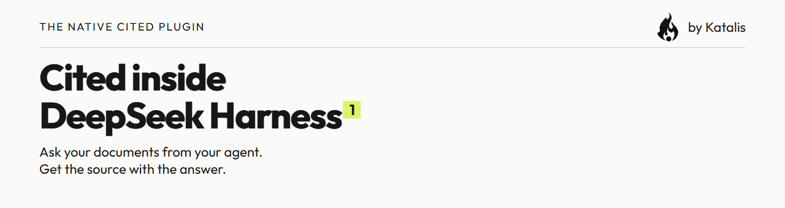
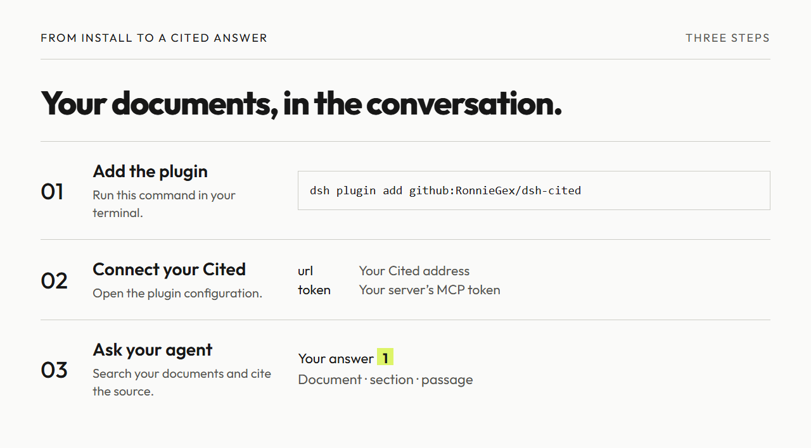
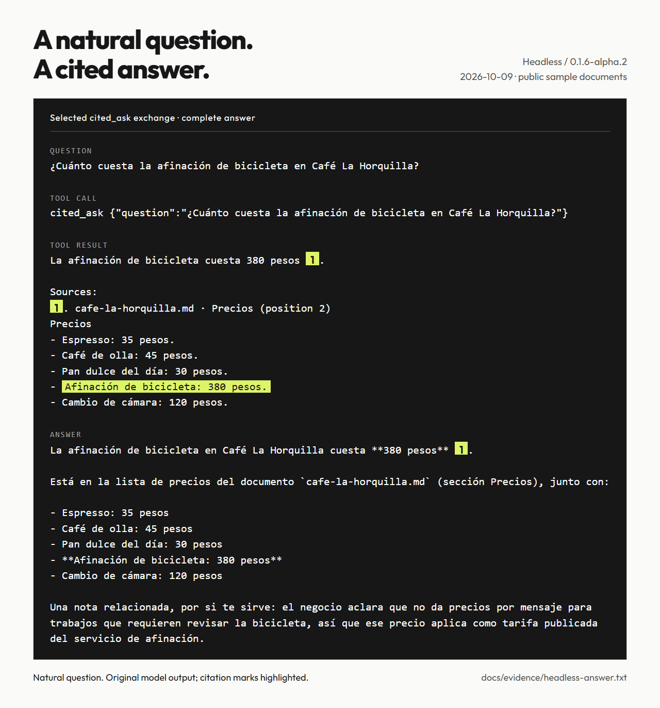

<h1 align="center"><picture><source media="(prefers-color-scheme: dark)" srcset="docs/images/readme-banner-dark.png"></picture></h1>

<p align="center">Ask your Cited documents from DeepSeek Harness and get the source with every answer.</p>

[](LICENSE)
[](#compatibility)
[](https://github.com/RonnieGex/dsh-cited/actions/workflows/ci.yml)


[English](README.md) · [Español](README.es.md) · [中文](README.zh.md)

- Keep your documents in Cited while you work in your agent.
- Check answers against numbered source passages.
- Choose document search or a full cited answer.

**Cited inside DeepSeek Harness.** Two native tools let your agent search a [Cited](https://github.com/RonnieGex/cited) installation and answer from its documents with numbered citations. The plugin connects to your configured installation over `POST /api/mcp`.

**Early development.** Installation and a real cited answer have been exercised headlessly. See the dated [compatibility table](#compatibility) for verification limits.

[How it works](#how-it-works) · [Real answer](#a-real-answer) · [Install](#install) · [Configure](#configure) · [Tools](#the-two-tools) · [Token](#your-token) · [Compatibility](#compatibility) · [Development](#development) · [License](#license)

## How it works

<picture><source media="(prefers-color-scheme: dark)" srcset="docs/images/how-it-works-dark.png"></picture>

1. Run `dsh plugin add github:RonnieGex/dsh-cited`.
2. Open the plugin configuration and set **url** and **token**.
3. Ask your agent. It calls `cited_search` or `cited_ask` and answers with `[1]`.

Cited hosts documents and retrieval. DeepSeek Harness hosts the agent and this plugin. No MCP client row in `cordis.yml` is needed for these native tools.

## Requirements

- DeepSeek Harness within the [declared peer range](#compatibility).
- A running Cited server with MCP enabled and its token.
- Node `>=22.19`; development and evidence use Node 24.

## A real answer

<picture><source media="(prefers-color-scheme: dark)" srcset="docs/images/real-answer-dark.png"></picture>

> La afinación de bicicleta en Café La Horquilla cuesta **380 pesos** [1].

**2 of 3 natural questions were answered with a supported price citation**, using keyword search without embeddings; the English question missed the Spanish passage and Cited refused. Recorded on 2026-10-09 with a locally built plugin in temporary headless state. The image shows one selected `cited_ask` exchange and the complete Spanish answer, with its source highlighted inside the tool result. Terminal Markdown stays raw. The [transcript](docs/evidence/headless-answer.txt) preserves every call; [all outcomes](docs/evidence/natural-summary.json) and [verification details](docs/evidence/compatibility.md) record the limits, models and database hashes.

## Install

Run the verified installation command:

```sh
dsh plugin add github:RonnieGex/dsh-cited
```

In the desktop app, use **Plugins → Add plugin** and paste `https://github.com/RonnieGex/dsh-cited` (not click-tested; see Compatibility).

The repository ships `lib/`: installation needs no compilation or `allowBuilds` permission.

## Configure

Open the plugin configuration:

| Field | Value |
|---|---|
| `url` | Your Cited address, such as `https://cited.example.com`. The plugin appends `/api/mcp`, or preserves it when already present. Query strings and fragments are dropped. |
| `token` | The server's `CITED_MCP_TOKEN`. Marked as a secret field. |
| `timeoutMs` | Positive call timeout in milliseconds; **30000** by default. |

Without a server token, Cited’s MCP endpoint is off. Generate one with `openssl rand -base64 32`, set it as `CITED_MCP_TOKEN` on the Cited server (see the [MCP guide](https://github.com/RonnieGex/cited/blob/main/docs/mcp.md)), and enter the same value in the plugin. Keep it out of prompts, screenshots and Git.

`url` and `token` start empty so you can install before configuring. A call reports the missing field as a tool error without breaking the harness. After filling both, ask your agent to search a phrase present in your documents.

## The two tools

| Tool | Input | Result |
|---|---|---|
| `cited_search` | `query: string`, `limit?: integer` from **1 to 8**, default **5** | `{ passages: [{ n, document, heading, position, excerpt }] }` |
| `cited_ask` | `question: string`, `sessionId?: string` | `{ status, answer, citations }`; status is `answered` or `refused` |

**Search, then let your agent answer.** `cited_search` retrieves passages without calling Cited's answer model. Each has its source and citation number. No matches means no passages, not an invented answer. The calling agent's model and any configured embedding provider can still incur charges.

**Let Cited write the answer.** `cited_ask` invokes Cited's answering pipeline and returns a cited answer or an explicit refusal. Citations have the passage fields above plus `lead`, the overlap length. The text result includes each source's document, section, position and exact excerpt. Reuse `sessionId` to persist a conversation and its thread on Cited. This can consume that server's model budget.

## Your token

- Sent as `Authorization: Bearer` to the configured endpoint; not added to tool arguments or normal output.
- Marked secret in the configuration schema for the harness's field handling. This does not establish encryption at rest. Protect the configuration; use HTTPS for remote servers.
- Redacted from transport failures, together with URL credentials. Rejected authorization, disabled endpoint, timeout and unreachable host become short tool errors.
- The plugin owns no document database. Cited stores documents and conversations created through `cited_ask` with a `sessionId`.

## Troubleshooting

| Error | Fix |
|---|---|
| Missing `url` or `token` | Fill in the named field in the plugin configuration. |
| `404` from Cited | Check `url`, set `CITED_MCP_TOKEN` on that server and restart it. |
| `401` from Cited | Make `token` match the server’s `CITED_MCP_TOKEN`. |
| Timeout | Check the host and network, then raise `timeoutMs` if needed. |

## Compatibility

Declared `@deepseek-ai/dsh-tools` peer range:

```text
>=0.1.6-alpha.2 <0.3.0-0 || >=0.2.0-rc.0 <0.3.0-0
```

A range is not proof of every version. MCP clients below connect directly to **Cited**, without this native plugin.

| Client | Date | Evidence and limit |
|---|---|---|
| DeepSeek Harness 0.1.6-alpha.2, source CLI | 2026-10-09 | Local built-plugin install and real DeepSeek `cited_ask` answer in isolated headless state; earlier GitHub installation is recorded in the provenance. [Record](docs/evidence/headless-answer.json); [gate](evidence/gate.txt). |
| DeepSeek Harness 0.2.0-rc.2, bundled CLI | 2026-10-09 | Installed and answered in a local run on 2026-10-09; raw log not kept in this repository. [Provenance](docs/evidence/compatibility.md). |
| Claude Code → Cited MCP | 2026-10-09 | Prior verification: connected and listed both tools. No model tool call claimed. [Provenance](docs/evidence/compatibility.md). |
| Codex → Cited MCP | 2026-10-09 | Prior verification: connected and listed both tools. No model tool call claimed. [Provenance](docs/evidence/compatibility.md). |
| Cursor → Cited MCP | 2026-10-09 | Documented only; not tested. [Provenance](docs/evidence/compatibility.md). |

Not verified: reliable cross-language retrieval without embeddings. In the [English run](docs/evidence/natural-2026-10-09T17-01-01-501Z/attempt-1.json), Cited refused and the agent falsely claimed the price was absent and a tune-up necessarily required inspection. In the [earlier English run](docs/evidence/natural-2026-10-09T16-16-13-632Z/attempt-1.json), it also falsely generalized that the documents did not cover bicycle services. These are agent errors, not evidence that the corpus lacks the price. The agent's marks [1] to [5] do not support its false claim; only the citations in the tool result carry Cited's source support. Desktop installation clicks, other operating systems and remote HTTPS deployments also remain unverified.

## Development

Use **Node 24**. Keep a built DeepSeek Harness checkout at `../deepseek-harness`, or set `DSH_INSTALL` to its root:

```sh
npx -y -p node@24 node scripts/link-host-deps.mjs
npx -y -p node@24 npm test
npx -y -p node@24 node scripts/build.mjs --check
npx -y -p node@24 npm run gate
```

Before the gate, set `CITED_REPO` to a built Cited checkout containing `scripts/mcp-seed.ts` and `.next/` (gate default: `../cited`). It creates sample data and a temporary `DSH_HOME` under `.tmp/gate`, starts Cited on port **3231**, installs the local plugin, checks its card and tools, and scans Git history with **gitleaks**. Override `CITED_PORT` for another free test port. It never uses the desktop profile.

`src/` is source; `lib/` is the shipped artifact. `npm run build` refreshes `lib/` after runtime changes.

CI runs portable transport, module, package, tool and documentation tests, build equivalence and secret scanning. Real Loader composition and the integration gate run locally with external checkouts; CI does not claim those integrations.

Render using Cited's existing Playwright dependency and installed Chromium. Set `CITED_REPO` to that checkout (renderer default: `../community-main`):

```sh
npx -y -p node@24 node scripts/render-readme-graphics.mjs
```

Rendering uses saved evidence offline. A new capture uses a real model and API key. See the [asset/evidence guide](docs/readme-assets.md), [project manual](docs/project-manual.md) and [contribution rules](CONTRIBUTING.md).

## License

[Apache-2.0](LICENSE). Keep [NOTICE](NOTICE) in redistributions. Outfit uses the [SIL Open Font License](docs/fonts/outfit/OFL.txt). See [asset provenance](docs/readme-assets.md).

<p align="center"><picture><source media="(prefers-color-scheme: dark)" srcset="docs/brand/katalis-flame-192.png"></picture> <a href="https://katalis.dev">Built by Katalis</a></p>
