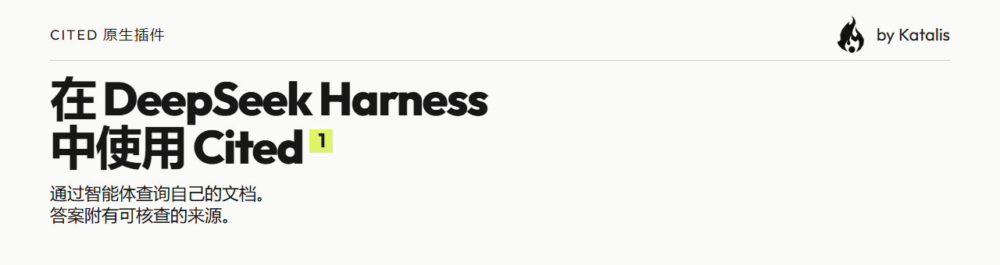
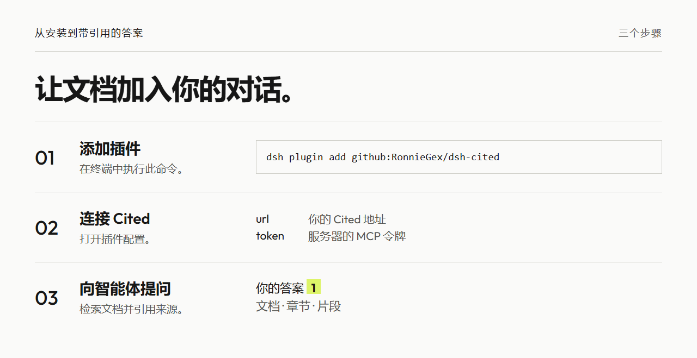
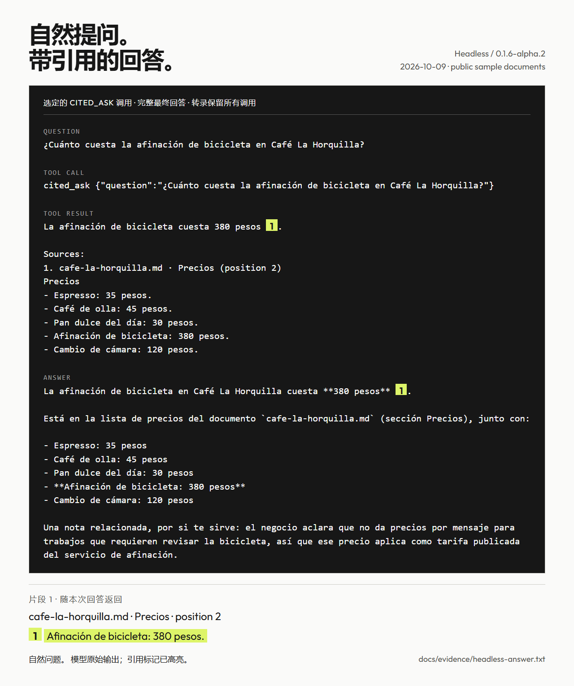

<h1 align="center"><picture><source media="(prefers-color-scheme: dark)" srcset="docs/images/readme-banner-zh-dark.png"></picture></h1>

<p align="center">通过 DeepSeek Harness 查询 Cited 文档，让每个答案附有可核查的来源。</p>

[](LICENSE)
[](#兼容性)
[](https://github.com/RonnieGex/dsh-cited/actions/workflows/ci.yml)


[English](README.md) · [Español](README.es.md) · [中文](README.zh.md)

- 在智能体中工作，文档仍由 Cited 管理。
- 通过编号片段核查答案的来源。
- 选择文档检索或完整的引用答案。

**在 DeepSeek Harness 中使用 Cited。** 两个原生工具让智能体搜索 [Cited](https://github.com/RonnieGex/cited) 实例，并依据文档生成带编号引用的答案。插件通过 `POST /api/mcp` 连接你配置的实例。

**处于早期开发阶段。** 已在无界面环境中验证安装及真实引用答案。验证范围见注明日期的[兼容性表](#兼容性)。

[工作原理](#工作原理) · [真实答案](#一次真实回答) · [安装](#安装) · [配置](#配置) · [工具](#两个工具) · [令牌](#你的令牌) · [兼容性](#兼容性) · [开发](#开发) · [许可证](#许可证)

## 工作原理

<picture><source media="(prefers-color-scheme: dark)" srcset="docs/images/how-it-works-zh-dark.png"></picture>

1. 执行 `dsh plugin add github:RonnieGex/dsh-cited`。
2. 打开插件配置，填写 **url** 和 **token**。
3. 向智能体提问。它调用 `cited_search` 或 `cited_ask`，并用 `[1]` 标注答案。

Cited 负责文档和检索，DeepSeek Harness 负责智能体与此插件。使用这两个原生工具不需要在 `cordis.yml` 中添加 MCP 客户端配置行。

## 环境要求

- 位于[声明版本范围](#兼容性)内的 DeepSeek Harness。
- 正在运行且已启用 MCP 的 Cited 服务器及其令牌。
- Node `>=22.19`；开发与验证使用 Node 24。

## 一次真实回答

<picture><source media="(prefers-color-scheme: dark)" srcset="docs/images/real-answer-zh-dark.png"></picture>

**2026-10-09**，在全新的临时 `DSH_HOME` 中安装本地构建的插件。面对自然问题，DeepSeek 调用 `cited_ask`；Cited 依据公开示例文档回答，随后 DeepSeek 回复：

> La afinación de bicicleta en Café La Horquilla cuesta **380 pesos** [1].
>
> Está en la lista de precios del documento `cafe-la-horquilla.md` (sección Precios), junto con:
>
> - Espresso: 35 pesos
> - Café de olla: 45 pesos
> - Pan dulce del día: 30 pesos
> - **Afinación de bicicleta: 380 pesos**
> - Cambio de cámara: 120 pesos
>
> Una nota relacionada, por si te sirve: el negocio aclara que no da precios por mensaje para trabajos que requieren revisar la bicicleta, así que ese precio aplica como tarifa publicada del servicio de afinación.

图片展示选定的 `cited_ask` 调用及完整的西班牙语最终回答。同一次运行还调用了 `cited_search`；[原始转录](docs/evidence/headless-answer.txt)和[运行记录](docs/evidence/headless-answer.json)保留所有调用。高亮片段来自本次 `cited_ask` 返回的引用。终端保留原始 Markdown，仅高亮引用标记。

**3 个自然问题中有 2 个获得带有依据引用的价格答案**；本次仅使用关键词搜索，没有 embeddings，英语问题可能无法匹配西班牙语价格片段，本次英语问题即未找到。[全部三个结果](docs/evidence/natural-summary.json)。

Harness 智能体使用 `deepseek-official / deepseek-v4-flash`；Cited 回答流程使用 `deepseek / deepseek-v4-flash`，来源是隔离服务器的实际启动配置。规范运行仅改变 `model_calls`；其他表的哈希（包括空的对话表）均未改变。

## 安装

执行已验证的安装命令：

```sh
dsh plugin add github:RonnieGex/dsh-cited
```

桌面应用中可使用 **Plugins → Add plugin** 并粘贴 `https://github.com/RonnieGex/dsh-cited`（未进行点击验证；参见兼容性）。

仓库已包含 `lib/`，安装不需要编译，也不需要 `allowBuilds` 权限。

## 配置

打开插件配置：

| 字段 | 值 |
|---|---|
| `url` | Cited 地址，例如 `https://cited.example.com`。插件会追加 `/api/mcp`；已有该路径时会保留。 查询参数和 URL 片段会被移除。 |
| `token` | 服务器的 `CITED_MCP_TOKEN`，标记为秘密字段。 |
| `timeoutMs` | 每次调用的正数超时值，单位毫秒；默认为 **30000**。 |

服务器未设置令牌时，Cited 的 MCP 端点关闭。用 `openssl rand -base64 32` 生成令牌，在 Cited 服务器上将其设置为 `CITED_MCP_TOKEN`（参见 [MCP 指南](https://github.com/RonnieGex/cited/blob/main/docs/mcp.md)），并在插件中填写相同值。不要把它放入提示词、截图或 Git。

`url` 和 `token` 初始为空，以便先安装再配置。缺少字段时，调用返回指出该字段的工具错误，不会破坏 harness。填写完毕后，让智能体搜索文档中实际存在的短语。

## 两个工具

| 工具 | 输入 | 结果 |
|---|---|---|
| `cited_search` | `query: string`，可选 `limit?: integer`，范围 **1 到 8**，默认 **5** | `{ passages: [{ n, document, heading, position, excerpt }] }` |
| `cited_ask` | `question: string`，可选 `sessionId?: string` | `{ status, answer, citations }`；状态为 `answered` 或 `refused` |

**先检索，再由智能体回答。** `cited_search` 检索片段，不调用 Cited 的回答模型。每个片段包含来源和引用编号。没有匹配就没有片段，不会凭空生成答案。调用方的智能体模型以及服务器配置的嵌入服务仍可能产生费用。

**让 Cited 撰写答案。** `cited_ask` 调用 Cited 的回答流程，返回附引用的答案或明确拒答。引用包含上表中的片段字段以及重叠文本长度 `lead`。文本结果包含每条来源的文档、章节、位置和原始片段。重复使用 `sessionId` 可以在 Cited 中保存对话并保持上下文。这可能消耗服务器的模型预算。

## 你的令牌

- 令牌通过 `Authorization: Bearer` 发送到配置的端点，不会添加到工具参数或正常输出中。
- 配置模式将它标记为秘密字段，供 harness 处理。这不等于证明静态存储已加密。请保护配置文件，并对远程服务器使用 HTTPS。
- 传输错误会隐藏配置的令牌和 URL 中的凭据。授权被拒绝、端点关闭、超时及主机不可达都会转换为简短的工具错误。
- 插件不拥有文档数据库。Cited 保存文档以及通过带 `sessionId` 的 `cited_ask` 创建的对话。

## 故障排查

| 错误 | 处理方法 |
|---|---|
| 缺少 `url` 或 `token` | 在插件配置中填写相应字段。 |
| Cited 返回 `404` | 检查 `url`，在服务器上设置 `CITED_MCP_TOKEN` 并重启。 |
| Cited 返回 `401` | 使 `token` 与服务器的 `CITED_MCP_TOKEN` 一致。 |
| 超时 | 检查主机和网络，再按需增大 `timeoutMs`。 |

## 兼容性

声明的 `@deepseek-ai/dsh-tools` peer 版本范围：

```text
>=0.1.6-alpha.2 <0.3.0-0 || >=0.2.0-rc.0 <0.3.0-0
```

版本范围不代表其中每个版本都已测试。下表中的 MCP 客户端直接连接 **Cited**，不经过此原生插件。

| 客户端 | 日期 | 证据与限制 |
|---|---|---|
| DeepSeek Harness 0.1.6-alpha.2，源码 CLI | 2026-10-09 | 本次在隔离 headless 状态中安装本地构建的插件，并由真实 DeepSeek 调用 `cited_ask` 回答；GitHub 安装为此前的独立验证。[记录](docs/evidence/headless-answer.json)；[gate](evidence/gate.txt)。 |
| DeepSeek Harness 0.2.0-rc.2，内置 CLI | 2026-10-09 | 已于 2026-10-09 在本地运行中完成安装并回答；本仓库未保留原始日志。[证据来源](docs/evidence/compatibility.md)。 |
| Claude Code → Cited MCP | 2026-10-09 | 先前验证：连接并列出两个工具。不宣称模型实际调用过工具。[来源](docs/evidence/compatibility.md)。 |
| Codex → Cited MCP | 2026-10-09 | 先前验证：连接并列出两个工具。不宣称模型实际调用过工具。[来源](docs/evidence/compatibility.md)。 |
| Cursor → Cited MCP | 2026-10-09 | 仅有文档，尚未测试。[来源](docs/evidence/compatibility.md)。 |

尚未验证：无 embeddings 时可靠的跨语言检索。在[本次英语运行](docs/evidence/natural-2026-10-09T17-01-01-501Z/attempt-1.json)中，Cited 拒答，智能体却错误声称文档没有价格，并称调校必须先检查车辆。[此前英语运行](docs/evidence/natural-2026-10-09T16-16-13-632Z/attempt-1.json)还错误声称文档不包含自行车服务。这些是智能体错误，不能证明文档缺少价格。

尚未验证：桌面点击安装、其他操作系统及远程 HTTPS 部署。

## 开发

使用 **Node 24**。将编译好的 DeepSeek Harness 放在 `../deepseek-harness`，或将 `DSH_INSTALL` 指向其根目录：

```sh
npx -y -p node@24 node scripts/link-host-deps.mjs
npx -y -p node@24 npm test
npx -y -p node@24 node scripts/build.mjs --check
npx -y -p node@24 npm run gate
```

运行 gate 前，将 `CITED_REPO` 指向包含 `scripts/mcp-seed.ts` 和 `.next/` 的已构建 Cited 工作副本，默认是 `../cited`。gate 在 `.tmp/gate` 下创建示例数据和临时 `DSH_HOME`，在 **3231** 端口启动 Cited，安装本地插件，验证插件卡片和工具，并通过 **gitleaks** 扫描 Git 历史。可设置 `CITED_PORT` 使用其他空闲测试端口。它从不使用桌面配置。

`src/` 是源码，`lib/` 是发布文件。修改运行时代码后执行 `npm run build` 更新 `lib/`。

CI 运行可移植的传输、模块、包、工具和文档测试，检查构建一致性并扫描秘密。真实 Loader 组合及集成 gate 需要外部工作副本，在本地运行；CI 不宣称覆盖这些集成。

渲染图片使用 Cited 已有的 Playwright 依赖和已安装的 Chromium。将 `CITED_REPO` 指向该工作副本，渲染器默认使用 `../community-main`：

```sh
npx -y -p node@24 node scripts/render-readme-graphics.mjs
```

渲染从已保存的证据离线生成图片；新的捕获会使用真实模型及 API 密钥。详见[资源与证据指南](docs/readme-assets.md)、[项目手册](docs/project-manual.md)和[贡献规则](CONTRIBUTING.md)。

## 许可证

[Apache-2.0](LICENSE)。重新分发时保留 [NOTICE](NOTICE)。Outfit 使用 [SIL Open Font License](docs/fonts/outfit/OFL.txt)。详见[资源来源](docs/readme-assets.md)。

<p align="center"><picture><source media="(prefers-color-scheme: dark)" srcset="docs/brand/katalis-flame-192.png"></picture> <a href="https://katalis.dev">Built by Katalis</a></p>
